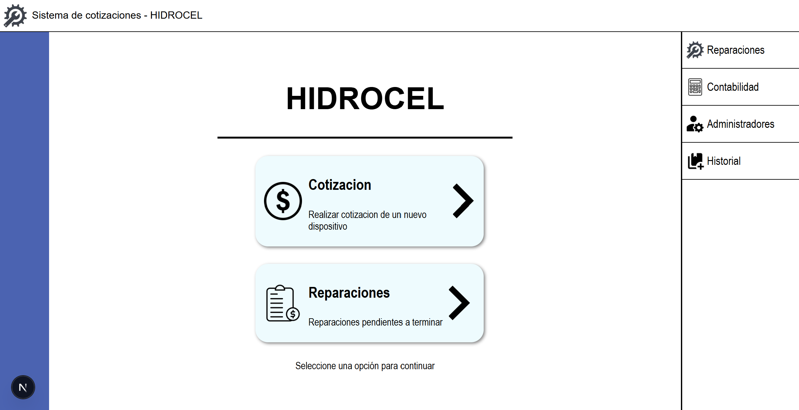

# Bienvenidos a Hidrocel Software



*Vista principal del sistema Hidrocel*

Hidrocel Software está diseñado para agilizar el proceso de generación de presupuestos, el seguimiento de su estado, el establecimiento de estándares de trabajo y la creación de tickets, permitiendo que los clientes reciban sus dispositivos de manera rápida y sencilla. Asimismo, el sistema incorpora una funcionalidad clave para la logística y la documentación: al confirmar un diagnóstico o crear una orden de reparación, Hidrocel genera automáticamente un nota de remisión mediante la biblioteca PDFKit. Esto garantiza que cada reparación o servicio vaya acompañado de un documento de envío profesional y estandarizado, lo que facilita la trazabilidad de los dispositivos y mejora la comunicación con el cliente.

## Arquitectura del Proyecto

Hidrocel esta desarrollado con una arquitectura moderna y robusta:

- **Backend**: Implementado con Express.js, proporcionando una API RESTful eficiente y escalable
- **Frontend**: Construido con Next.js y TypeScript, ofreciendo una experiencia de usuario fluida y moderna
- **Base de Datos**: MySQL como sistema gestor de bases de datos para garantizar la integridad y persistencia de los datos
- **Estructura**: La carpeta `backup` contiene el codigo fuente del frontend, asegurando que siempre tengas una copia de respaldo de la interfaz de usuario

## Como configurar en editores de codigo

Durante los siguientes apartados, veremos los pasos a seguir para conseguir ejecutar el sistema
dentro de un editor de texto.

### Pasos para configurar el proyecto

> [!IMPORTANT]
> Para el correcto funcionamiento, es necesario tener instalado node.js y contar con MySQL

1. Configura el archivo .env.example con tus datos de MySQL:
```
  # Ejemplo
PORT=3000
DB_HOST=localhost
DB_USER=root
DB_PASSWORD=tu_contraseña
DB_NAME=db_hidrocel
GMAIL_USERNAME=tuGmail@gmail.com
GMAIL_PASSWORD=miContraseña
```

> [!NOTE]
> Para utilizar una contraseña de aplicacion para tu correo, consulta el siguiente tutorial: https://youtu.be/h4eVrDSf8Eg?si=cr7_SoPJtoXKa8wD . Esto impide que se vulnerabilice tu contraseña real.


2. Cambia el nombre del archivo ".env.example" a ".env"
3. Ejecuta el comando en tu cmd en la carpeta raiz del proyecto:
```
npm run setup
```

> [!NOTE]
> Durante la configuracion, el sistema necesitara tu contraseña de MySQL.

### Como iniciar el proyecto

> [!WARNING]
> Antes de ejecutar, recuerda realizar la configuracion del proyecto

El programa es capaz de iniciarse de 3 maneras dependiendo las necesidades que se requieran.

1. Inicia el proyecto completo:
```
npm run project
```

2. Inicia unicamente el backend del proyecto:
```
npm run backend
```

3. Inicia unicamente el frontend del proyecto:
```
npm run frontend
```

## Modos de ejecucion

Existen dos maneras de ejecutar el programa, una como desarrollador y otra como cliente. Aqui te dejamos la manera para ejecutar cada uno:

1. Modo desarrollador:
```
npm run project
```

2. Modo cliente:
```
npm run startExe
```

> [!WARNING]
> Antes de ejecutar startExe, porfavor utilizar el comando "npm run export"

## Scripts Disponibles

El proyecto cuenta con una serie de scripts automatizados para facilitar su desarrollo, despliegue y mantenimiento:

| Script | Descripcion |
|--------|-------------|
| `test` | Script de prueba basico (actualmente en desarrollo) |
| `setup` | Configuracion completa del proyecto incluyendo backend y frontend |
| `setup:backend` | Configura la base de datos MySQL e instala todas las dependencias del backend |
| `setup:frontend` | Crea y configura el proyecto Next.js, restaurando los archivos desde la carpeta backup |
| `project` | Ejecuta simultaneamente el frontend y el backend en modo desarrollo |
| `backend` | Inicia unicamente el servidor backend |
| `frontend` | Inicia unicamente el servidor frontend en modo desarrollo |
| `build:frontend` | Compila el frontend para produccion |
| `build:backend` | Instala las dependencias del backend |
| `build` | Compila tanto frontend como backend para produccion |
| `start:prod` | Inicia el servidor backend en modo produccion |
| `build:exe` | Compila el proyecto en un ejecutable para Windows |
| `build:exe:debug` | Compila el ejecutable en modo debug |
| `export` | Compila todo el proyecto, genera el ejecutable y crea un archivo ZIP para distribucion |
| `startExe` | Ejecuta el programa directamente desde el archivo ejecutable |

## Como instalar la aplicacion

Para poder instalar el proyecto de manera simple y sencilla, entra al siguiente enlace y descarga el archivo .zip, guardalo en tu computadora y sigue los pasos dentro del archivo llamado README.md

Si deseas descargar el .exe desde un editor de codigo, utiliza el siguiente comando:
```
npm run export
```

Utiliza el archivo hidrocel-app.zip o la carpeta distribution para ejecutar el programa con el archivo start.bat.

## Obtener ayuda / Documentacion

### Recursos Adicionales

- **Mockups y diagramas de flujo**: https://canva.link/zjb0wz69gwrzrtp

Estos recursos te ayudaran a comprender mejor la arquitectura del sistema, el flujo de trabajo y la interfaz de usuario propuesta para Hidrocel.

---

*Hidrocel Software - Facilitando la gestion de cotizaciones y tickets*